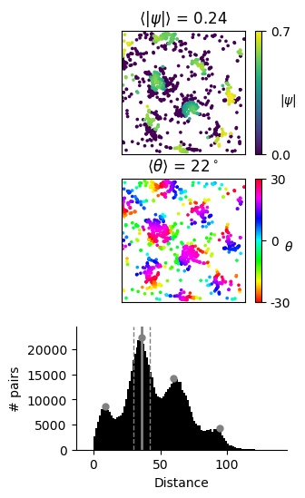
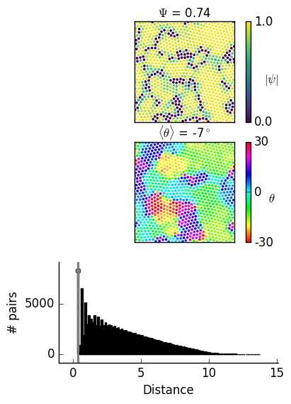

# gridscore

Python 3 package for the PSI grid score for individual spikes in the firing of grid cells.

The PSI score assigns a complex number, psi, to each spike.
The absolute value of that number quantifies how much this spike is involved
in the *local gridness* of the firing pattern.
The angle of that complex number in the complex plane is informative about the
*local orientation* of the grid pattern.

# Dependencies

* You need Python 3, NumPy and SciPy
* For plotting you need matplotlib

# Getting started

* If you have spike positions, for example from your experiments,
and you want to get the PSI score for
each of the spikes, use the code snippet below. It calculates the local PSI score,
the global PSI score, the local orienation and the global orientation, for an
example array with N spike positions of shape (N, 2).

* Replace `spikepositions.npy` with your own (N, 2) ndarray. Also replace
`arena_limits` with the limits of your arena in x and y direction.
You can also provide `spiketimes.npy` which needs to be of shape (N), or 
you can just set `spiketimes = None`. Spike times are only necessary for
time evolution analysis.

* Make sure that the code snippet can import from the gridscore package. For
example, download the `gridscore` package to a directory named `mydirectory` on your
machine and store the code below in a file named `test.py`, then store this file
also in the directory `mydirectory`. You can copy all of the code from the
file `example_spikepositions.py` (for data with spike positions),
 or from the file `example_fieldpositions.py`
 (for data with hexagonally aranged fields) to your file `test.py`.
Alternatively, you could add the `gridscore` package to your Python path, then
you can import it from anywhere.

# Example code

## Example with spike locations from grid cell firing

The PSI score for spikes of an experimentally recorded grid cell.
Data from [Sargolini et al. 2006](http://science.sciencemag.org/content/312/5774/758.short)
obtained from [http://www.ntnu.edu/kavli/research/grid-cell-data](http://www.ntnu.edu/kavli/research/grid-cell-data).
This code is stored in `example_spikepositions.py`.
But make sure that you put it up one step in the folder
hierarchy, to be able to import from the `gridscore` package, see above.
```python
import numpy as np
from gridscore import spikes
from scipy.stats import circmean

# Data of a 10 minute recording.
# Precisely: recording 11016-31010502_T6C3 from Sargolini et al. 2006.
# Load spikepositions for this recording.
spikepositions = np.load('spikepositions.npy')

# Spiketimes of the spikepositions.
# Irrelevant for the final grid score, but needed for plotting the
# time evolution of the grid score (if desired).
# spiketimes = np.load('spiketimes.npy')
# If time data don't matter or don't exist, it can be set to None.
spiketimes = None

# The arena in the Sargolini 2006 experiments is quadratic and
# between -50 cm and 50 cm in both dimensions.
arena_limits = np.array([[-50, 50], [-50, 50]])
# Initiating a Spikes class
spks = spikes.Spikes(positions=spikepositions, arena_limits=arena_limits,
					 times=spiketimes)

# PSI: A complex number for each spike
psi = spks.psi()

# The absolute value of psi gives the local grid score of each spike
psi_abs = np.absolute(psi)

# The global PSI grid score is the mean of the individual scores
global_gridscore = np.mean(psi_abs)
print('PSI gridscore:', global_gridscore)

# The direction of psi gives the local orientation of the grid around each spike
# All elements with psi strictly zero did not pass the comparison with
# other symmetries. These 0 would flawfully indicate 0 orienation.
# We therefore set them to NaN.
psi = spks.psi(compare_to_other_symmetries=False)

# Each angle between two neighboring spikes is increased in psi
# by a factor of 6. To get the local orientation, we need to
# undo this rotation by dividing by 6.
# NB: np.angle returns angles in the range -Pi to +Pi.
# So for n_symmetry = 6 the line below leads to
# angles between -30 and 30 degrees.
psi_angle = np.angle(psi, deg=True) / 6

# The global grid orientation is the circular mean of the local orientations
global_orientation = circmean(psi_angle, high=30, low=-30)
print('Global grid orientation:', global_orientation)
```

### Plotting the results of the above analysis

```python
from gridscore import plotting
import matplotlib.pyplot as plt

plt.figure(figsize=(3, 6))

# The size of the symbols for each spike in pts
dotsize = 7

# Instantiating the Plot class
plot = plotting.Plot(spikepositions=spikepositions, arena_limits=arena_limits)

# Local grid scores
plt.subplot(311)
plot.spikemap(shell_limits_choice='automatic_single', dotsize=dotsize)

# Local orientations
plt.subplot(312)
plot.spikemap(shell_limits_choice='automatic_single',
			  compare_to_other_symmetries=False,
			  color_code='psi_angle', dotsize=dotsize)

# Histogram of distances between all locations with highlighted shell.
plt.subplot(313)
plot.distance_histogram()

plt.show()
```

You should obtain a figure like this:




## Example with grid field locations from simulations

The PSI score for fields of grid cells from simulations.
Data provided through the courtesy of Sophie Rosay.
This code is stored in `example_fieldpositions.py`.

```python
import numpy as np
from gridscore import spikes
from scipy.stats import circmean
import scipy.io as sio

# Instead of taking the second peak in the histogram (default maximum_index = 1)
# we take the first peak
maximum_index = 0
# We weight each peak in the histogram of distances between all locations
# by the distance.
# This make it trivial to obtain the first peak.
weights = 'inverse_distance'

# Load spikepositions for this recording
# We need an array of shape (N, 2)
# The array in the matlab file is of shape (2, N). We therefore take
# the transpose.
spikepositions = sio.loadmat('positions.mat')['positions'].T

# The arena ranges from 0 to 10 along both dimensions.
arena_limits = np.array([[0, 10], [0, 10]])

# Initiating a Spikes class
spks = spikes.Spikes(positions=spikepositions, arena_limits=arena_limits)

# PSI: A comple number for each spike
psi = spks.psi(weights=weights, maximum_index=maximum_index)

# The absolute value of psi give the grid score of each spike
psi_abs = np.absolute(psi)

# The global PSI grid score is the mean of the individual scores
global_gridscore = np.mean(psi_abs)
print('PSI gridscore:', global_gridscore)

# The direction of psi give the local orientation of the grid around each spike
# See explanation above.
psi_angle = np.angle(psi, deg=True) / 6

# The global grid orientation is the circular mean of the local orientations
# See explanation above.
global_orientation = circmean(psi_angle[np.isfinite(psi_angle)],
							  high=30, low=-30)
print('Global grid orientation:', global_orientation)
```
### Plotting the results of the above analysis

```python
from gridscore import plotting
import matplotlib.pyplot as plt

plt.figure(figsize=(4, 6))
dotsize = 7

# Instantiating the Plot class
plot = plotting.Plot(spikepositions=spikepositions, arena_limits=arena_limits)

# Local grid scores
plt.subplot(311)
plot.spikemap(shell_limits_choice='automatic_single', weights=weights,
			  dotsize=dotsize, compare_to_other_symmetries=True,
			  maximum_index=maximum_index)

# Local grid orientations
plt.subplot(312)
plot.spikemap(shell_limits_choice='automatic_single',
			  compare_to_other_symmetries=False,
			  color_code='psi_angle', weights=weights,
			  dotsize=dotsize, maximum_index=maximum_index)

# Histogram of distances between all locations with highlighted shell.
plt.subplot(313)
plot.distance_histogram(weights=weights, maximum_index=maximum_index)

plt.savefig('figures/fieldpositions.png', dpi=100, bbox_inches='tight')
plt.show()
```
You should obtain a figure like this:



# Structure

Files you will be interested in:
* `spikes.py`: The gist of the grid score

Files you won't care about:
* `spikedata.py`: Functions to gather data from experiments and to
create artifical spike data.

# Help
You got the code running, but your results look strange? Contact me over gitlab.
